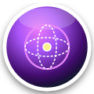
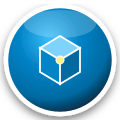

# Hello, I'm Rishav Raj 👋

<p align="left">
  
  
  
  
</p>

### 🔮 Quantitative Systems Architect & Mathematical AI Researcher
I architect first-principles machine learning foundations, non-Euclidean geometric deep learning manifolds, stochastic calculus engines, causal discovery systems, and microsecond-level algorithmic trading frameworks.

---

## 🏆 GitHub Profile Achievements & Badges

### 🌟 Official GitHub Achievements Showcase
<p align="left">
  
  
  
  
  
  
  
  
</p>

### 🎖️ AI & Mathematical Research Mastery Badges
<p align="left">
  
  
  
  
  
  
</p>

---

## 🏛️ Master AI/ML Monorepo & Algorithmic Foundry

### ⚡ **[ai-ml-algorithmic-foundry](https://github.com/Rishav-raj-github/ai-ml-algorithmic-foundry)**
*The Definitive 16-Module Mathematical AI/ML Foundry & Practice Arena — Built from first principles in vectorized NumPy/SciPy with zero black-box dependencies.*

```
ai-ml-algorithmic-foundry/
├── 01_supervised_learning                          :: OLS, Ridge, Coordinate Descent Lasso, Dual SMO SVM (RBF), GBDT
├── 02_unsupervised_learning                        :: Kernel PCA, Exact Barnes-Hut t-SNE, GMM (EM), Spectral Clustering
├── 03_deep_learning_foundations                    :: Dynamic Autograd Tensor Graph, Conv2D (im2col), AdamW, LSTM, GRU
├── 04_transformers_and_llms                        :: Multi-Head Attention, RoPE Embeddings, KV-Cache, GPT (SwiGLU)
├── 05_reinforcement_learning                       :: Policy Iteration, Deep Q-Networks (DQN), PPO with GAE
├── 06_probabilistic_generative_models              :: Hidden Markov Models (Baum-Welch EM), VAE (ELBO), DDPM Diffusion
├── 07_graph_neural_networks                        :: Spectral GCN Laplacians, Graph Attention (GAT), GraphSAGE
├── 08_optimization_and_search                      :: L-BFGS Two-Loop Recursion, Conjugate Gradient, PSO, MCTS / UCT
├── 09_causal_inference_and_discovery               :: Non-Linear SEMs, PC Algorithm, Hajek IPW, Doubly Robust Estimator
├── 10_time_series_and_forecasting                  :: Fractional Differencing, Kalman/Particle Filters, N-BEATS Expansion
├── 11_federated_and_privacy_preserving_ml          :: Laplace/Gaussian DP, DP-SGD, FedAvg, FedProx, Shamir Secret Sharing
├── 12_computational_neuroscience_and_spiking_nn    :: Hodgkin-Huxley 4D, Izhikevich, STDP, SNN Surrogate Gradient BPTT
├── 13_data_engineering_and_feature_store           :: Count-Min Sketch, HyperLogLog, OOF Target Encoding, MICE, iForest
├── 14_evaluation_and_statistical_testing           :: Non-Parametric Permutations, FDR q-values, ECE, Purged Embargoed CV
├── 15_mlops_and_system_design                      :: PSI, Wasserstein Drift, Int8 Quantization, Magnitude Pruning, KD
└── 16_data_science_case_studies_and_benchmarks     :: Market Microstructure (VPIN), Two-Tower Recommender, Cox Survival
```

---

## 🔬 Top-Tier Standalone AI & Mathematical Research Repositories

1. **[causal-manifold-scm](https://github.com/Rishav-raj-github/causal-manifold-scm)**
   - Augmented Lagrangian Continuous DAG Discovery ($\text{Tr}(\exp(W \odot W)) - d = 0$).
   - Double Machine Learning (DML) CATE with Neyman-Orthogonal cross-fitting & Conformal Counterfactual bands.
2. **[riemannian-topological-flow](https://github.com/Rishav-raj-github/riemannian-topological-flow)**
   - Poincaré Ball ($\mathbb{H}^n$) & Spherical ($\mathbb{S}^n$) Riemannian Geometry.
   - Pontryagin Adjoint Neural ODE Continuous Integration & Vietoris-Rips Persistent Landscapes $\lambda_k(t)$.
3. **[neural-sde-extremes](https://github.com/Rishav-raj-github/neural-sde-extremes)**
   - Itô-Euler-Maruyama & Strong Order 1.0 Milstein Stochastic Differential Equation Solvers.
   - Jump-Diffusion SDEs (Merton & Kou) + Extreme Value Theory (EVT) GPD POT & Martingale CUSUM-SPRT.
4. **[bayesian-active-surrogate](https://github.com/Rishav-raj-github/bayesian-active-surrogate)**
   - Deep Kernel Learning Gaussian Processes with Spectral Mixture Kernels.
   - $O(N)$ Lanczos Krylov Tridiagonalization & $q\text{-EHVI}$ Multi-Objective Pareto Active Learning.
5. **[neurosymbolic-tensor-verifier](https://github.com/Rishav-raj-github/neurosymbolic-tensor-verifier)**
   - Continuous t-Norm First-Order Logic Relaxations (Product, Łukasiewicz, Gödel).
   - High-order CP-ALS, Tucker HOSVD, Tensor-Train factorizations & Spectral Lipschitz Lyapunov Stability Certificates.

---

## ⚡ High-Frequency Quantitative Engineering & Systems

* **[submicrosecond-lob-engine](https://github.com/Rishav-raj-github/submicrosecond-lob-engine)**: Sub-microsecond matching engine in C++20 with lock-free SPSC queues, contiguous cache-aligned memory arenas, and AVX-512 SIMD parsing.
* **[helix-live-execution-oms](https://github.com/Rishav-raj-github/helix-live-execution-oms)**: Event-driven algorithmic execution OMS with dynamic Donchian volatility channels and real-time risk guards.
* **[market_maker_algo](https://github.com/Rishav-raj-github/market_maker_algo)**: Multi-threaded Avellaneda-Stoikov market maker combining Cython C-extensions, Kafka streaming, and Redis caching.

---

## 🛠️ Technical Mastery & Core Arsenal

```
🧠 Machine Learning & Theory :: First-Principles Autograd, Transformers, SDEs, Causal SEMs, GNNs, SNNs, DML
⚡ Systems & Low-Latency    :: C++20, Python 3.10+, Rust, CUDA, AVX-512 SIMD, Lock-Free Concurrency
📊 Math & Scientific Stack  :: NumPy, SciPy, Linear Algebra, Differential Geometry, Topology, Measure Theory
☁️ Architecture & MLOps     :: Int8 Quantization, DP-SGD, Distributed FedProx, Kafka, Docker, Linux Perf
```

---

## 📈 Developer Telemetry & GitHub Stats

<p align="center">
  
  
</p>
